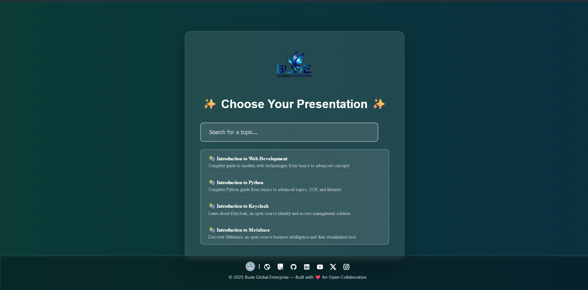
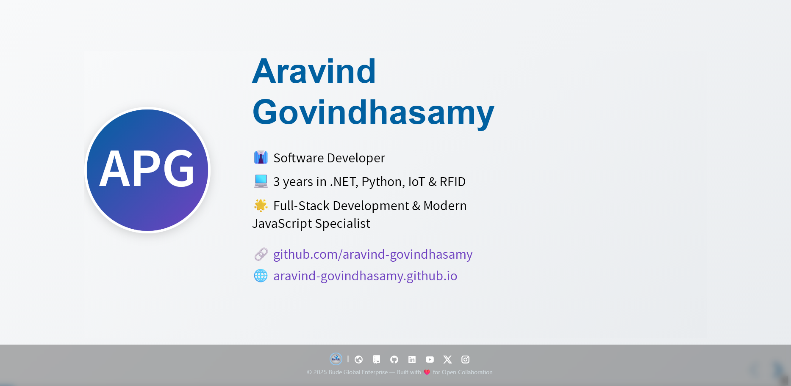
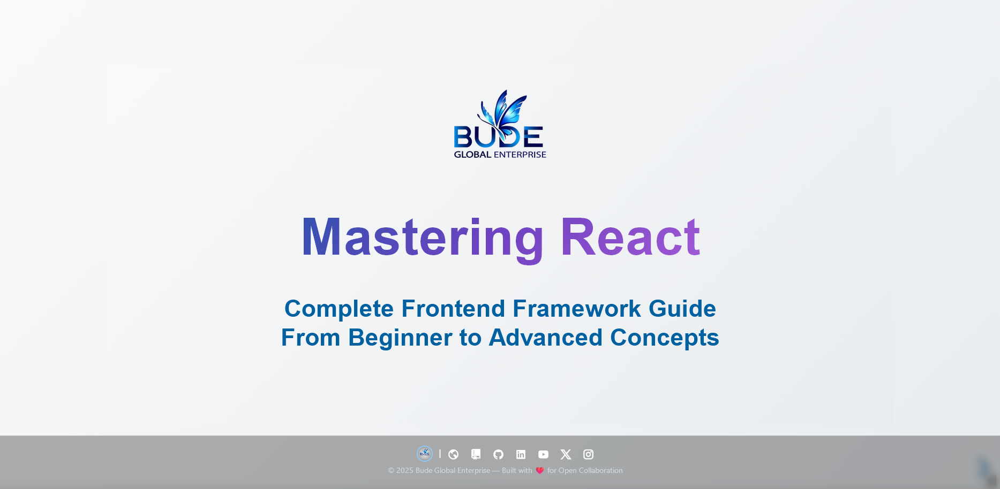

# 🚀 Bude Global Tech Presentations 🚀

Welcome to the official repository for Bude Global Tech Presentations! This platform serves as a dynamic and interactive hub to host and showcase a diverse range of technical presentations crafted by our vibrant Bude Global community. Our goal is to foster knowledge sharing, learning, and collaboration through engaging visual content.

---

## 📝 Table of Contents

-   [✨ Features](#-features)
-   [👨‍💻 Technologies Used](#-technologies-used)
-   [🏗️ Project Structure](#%EF%B8%8F-project-structure)
-   [👀 How to View Presentations](#-how-to-view-presentations)
-   [➕ How to Add a New Presentation](#-how-to-add-a-new-presentation)
-   [🤝 Contributing](#-contributing)
-   [📸 Screenshots](#-screenshots)
-   [©️ License](#%C2%A9%EF%B8%8F-license)
-   [📧 Contact](#-contact)

---

## ✨ Features

-   **Dynamic Presentation Loading**: Effortlessly discovers and loads presentation content directly from lightweight JSON files, enabling flexible content management.
-   **Intuitive Search & Filter**: Quickly locate specific presentations using a real-time search functionality that filters by title, description, and relevant keywords.
-   **Responsive & Modern Design**: Enjoy an optimal viewing experience across all devices (desktops, tablets, and mobile phones) thanks to a clean, modern, and adaptive user interface.
-   **Smooth Navigation**: Navigate through presentations with ease using both on-screen controls and keyboard shortcuts.
-   **Modular Content Structure**: Keeps presentation configurations neatly separated from the core logic, making it simpler to add, update, and manage content.

---

## 👨‍💻 Technologies Used

This project leverages the following technologies:

-   **HTML5**: For structuring the web content.
-   **CSS3**: For styling and responsive design.
-   **JavaScript (ES6+)**: For dynamic behavior and presentation loading logic.
-   **Reveal.js**: A powerful and flexible framework for creating beautiful HTML presentations.
    -   Used for slide transitions, speaker notes, and overall presentation structure.
-   **Remixicon**: A collection of open-source neutral style system symbols.
-   **Google Fonts (Molot)**: For custom typography.

---

## 🏗️ Project Structure

```
.
├── assets/
│   ├── fonts/
│   ├── icons/
│   └── images/
│       └── budeglobal_logo.png
├── presentations/
│   ├── intro-keycloak.json
│   ├── intro-metabase.json
│   ├── intro-oss.json
│   ├── intro-python.json
│   ├── intro-csharp.json
│   ├── intro-maui.json
│   ├── erpnext-presentation.json
│   ├── frappe-presentation.json
│   ├── intro-git-github.json
│   ├── intro-gitea.json
│   ├── intro-linux.json
│   ├── intro-docker.json
│   ├── tailwind-css-presentation.json
│   ├── bootstrap-presentation.json
│   └── react-presentation.json
├── templates/
│   └── sample-presentation.json
├── index.html
├── loader.js
├── presentations.js
├── presenter.js
├── style.css
├── LICENSE
└── README.md
```

---

## 👀 How to View Presentations

Getting started is simple!

1.  **Clone the repository**:
    Open your terminal or command prompt and run:
    ```bash
    git clone https://github.com/BUDEGlobalEnterprise/bude-global-tech-presentations.git
    cd bude-global-tech-presentations
    ```
2.  **Open `index.html`**:
    Navigate to the cloned directory and simply open the `index.html` file in your preferred web browser.

    A beautifully designed presentation selector will greet you, allowing you to easily browse and choose from available technical talks.

---

## ➕ How to Add a New Presentation

We encourage community members to share their knowledge! Here's how to contribute a new presentation:

1.  **Create your Presentation JSON File**:
    -   Inside the `presentations/` directory, create a new `.json` file for your presentation (e.g., `my-awesome-tech-talk.json`).
    -   Structure your JSON content similar to the `templates/sample-presentation.json` or any other existing presentation file. This includes defining slides, topics, and their respective content.

2.  **Update `presentations.js`**:
    -   Open `presentations.js` located in the root directory.
    -   Add a new entry to the `PRESENTATIONS_CONFIG` array for your presentation.
    -   Ensure the `file` path, `title`, `description`, and `keywords` are accurate and descriptive. Keywords are crucial for search functionality!

    ```javascript
    // Example of a new entry in presentations.js
    {
      file: "presentations/my-awesome-tech-talk.json",
      title: "My Awesome Tech Talk",
      description: "An engaging overview of a cutting-edge technology or concept.",
      keywords: ["awesome", "tech", "innovation", "new-tech"],
    },
    ```

3.  **Commit and Push Your Changes**:
    -   Stage your new `.json` file and the updated `presentations.js` file.
    -   Commit your changes with a clear and concise message.
    -   Push your changes to your forked repository (if contributing via a fork), and then open a Pull Request to the main repository.

---

## 🤝 Contributing

We heartily welcome contributions of all kinds! Whether you're fixing a bug, improving documentation, adding a new feature, or sharing a new presentation, your efforts are valued. Please refer to our [Contributing Guidelines](CONTRIBUTING.md - *To be created*) for detailed instructions on how to get started.

---

## 📸 Screenshots

### Home Page


### Author Page


### React Presentation Example


---

## ©️ License

This project is open-sourced under the MIT License. For more details, see the [LICENSE](LICENSE) file in this repository.

---

## 📧 Contact

For any inquiries, suggestions, or collaborations, please feel free to reach out to the Bude Global team.

---

**Developed with ❤️ for Open Collaboration**