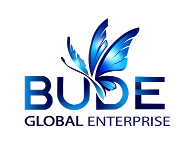
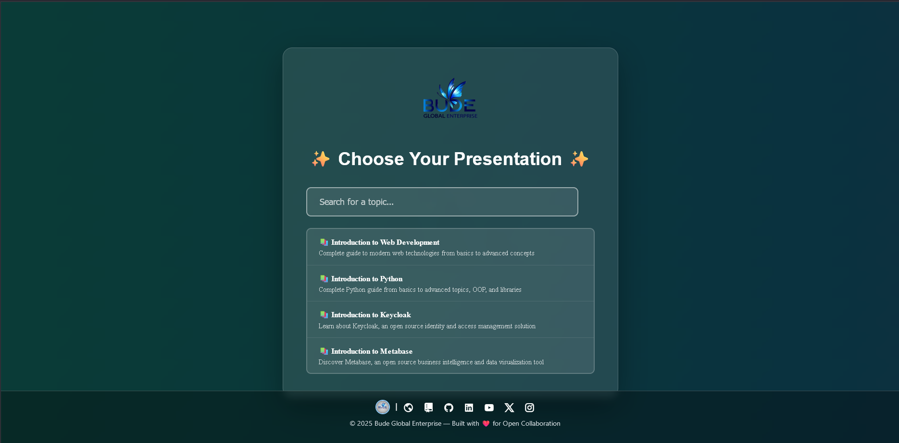
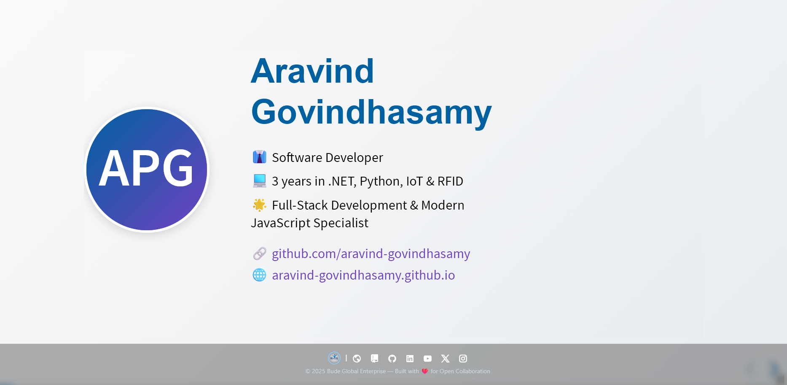
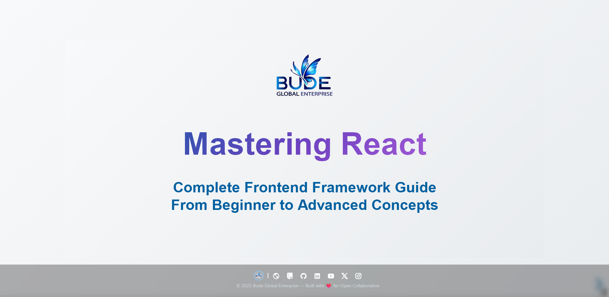

# 🚀 Bude Global Tech Presentations 🚀

<div align="center">



**A Dynamic, Interactive Platform for Technical Knowledge Sharing**

💚 **[Join our WhatsApp Community](https://chat.whatsapp.com/BIrcLvcEAJrB23WlUUbkuC)** 💚

[](LICENSE)
[](CONTRIBUTING.md)
[](https://github.com/BUDEGlobalEnterprise/bude-global-tech-presentations)

[View Demo](https://budeglobalenterprise.github.io/bude-global-tech-presentations) • [Report Bug](https://github.com/BUDEGlobalEnterprise/bude-global-tech-presentations/issues) • [Request Feature](https://github.com/BUDEGlobalEnterprise/bude-global-tech-presentations/issues)


<p align="center">
  Scan the QR to support the project 👇  
  <br><br>
  
</p>

### Sponsors

Become a sponsor and get your logo on our README on GitHub with a link to your site.
</div>

## 🌟 Overview

Welcome to the official repository for **Bude Global Tech Presentations** — a cutting-edge platform designed to democratize technical knowledge through engaging, interactive presentations. Built by developers, for developers, this platform serves as a centralized hub where the Bude Global community can discover, share, and learn from expertly crafted technical content.

**Important**: By using this service, you agree to our [Terms and Conditions](Terms%20and%20Conditions.md) and [Privacy Policy](PRIVACY_POLICY.md).

### 🎯 Mission

Our mission is to foster a culture of continuous learning and knowledge sharing by providing an accessible, modern platform for technical presentations that covers everything from programming languages and frameworks to DevOps tools and best practices.

---

## 📝 Table of Contents

- [✨ Features](#-features)
- [🎬 Demo & Screenshots](#-demo--screenshots)
- [🛠️ Technologies Used](#-technologies-used)
- [🏗️ Project Structure](#-project-structure)
- [🚀 Quick Start](#-quick-start)
- [👀 How to View Presentations](#-how-to-view-presentations)
- [➕ How to Add a New Presentation](#-how-to-add-a-new-presentation)
- [📋 Presentation JSON Schema](#-presentation-json-schema)
- [⌨️ Keyboard Shortcuts](#-keyboard-shortcuts)
- [🤝 Contributing](#-contributing)
- [📚 Available Presentations](#-available-presentations)
- [🔧 Customization](#-customization)
- [❓ FAQ](#-faq)
- [©️ License](#-license)
- [📜 Terms and Conditions](#-terms-and-conditions)
- [🙏 Acknowledgments](#-acknowledgments)
- [📧 Contact](#-contact)

---

## ✨ Features

### 🎨 Core Functionality

- **🔍 Smart Discovery System**: Automatically scans and validates presentation JSON files with built-in format checking
- **⚡ Real-Time Search**: Instantly filter presentations by title, description, or keywords with autocomplete suggestions
- **📱 Fully Responsive**: Seamless experience across desktops, tablets, and mobile devices with adaptive layouts
- **🎭 Beautiful UI/UX**: Modern gradient designs, smooth animations, and intuitive navigation
- **⌨️ Keyboard Navigation**: Full keyboard support for power users (arrow keys, shortcuts, and more)
- **📊 Format Validation**: Only displays presentations that pass strict JSON schema validation
- **🎯 Modular Architecture**: Clean separation of concerns with easy-to-maintain codebase

### 🎓 Presentation Features

- **📖 Multi-Topic Support**: Organize content into logical sections and topics
- **💻 Code Syntax Highlighting**: Beautiful code blocks with proper formatting
- **🎨 Rich Content Types**: Support for text, code, lists, images, emojis, and custom styling
- **📝 Speaker Notes**: Built-in support for presenter notes (Reveal.js feature)
- **🔄 Smooth Transitions**: Professional slide transitions and animations
- **📏 Scrollable Content**: Handles long slides with smooth scrolling

### 🔧 Developer Experience

- **📦 JSON-Based**: Simple JSON format for easy content creation
- **🎨 Customizable Themes**: Easy to customize colors, fonts, and styles
- **🔌 Extensible**: Built on Reveal.js with support for plugins
- **📋 Template System**: Pre-built templates for quick presentation creation
- **🚀 No Build Process**: Pure HTML/CSS/JS — no compilation required

---

## 🎬 Demo & Screenshots

### 🏠 Home Page - Presentation Selector

*Smart search and autocomplete for quick presentation discovery*

### 👤 Author/Presenter Page

*Professional presenter introduction with social links*

### 📊 React Presentation Example

*Clean, modern slide design with code examples*

---

## 🛠️ Technologies Used

This project leverages modern web technologies for optimal performance and developer experience:

| Technology | Purpose | Version |
|------------|---------|---------|
| **HTML5** | Structure and semantic markup | Latest |
| **CSS3** | Styling, animations, and responsive design | Latest |
| **JavaScript (ES6+)** | Dynamic behavior and presentation logic | ES2020+ |
| **[Reveal.js](https://revealjs.com/)** | Presentation framework | 4.6.0 |
| **[Remixicon](https://remixicon.com/)** | Icon system | 4.3.0 |
| **Google Fonts** | Custom typography (Molot) | - |

### Why These Technologies?

- ✅ **No dependencies**: Zero npm packages, runs directly in browser
- ✅ **Fast loading**: Minimal external resources with CDN optimization
- ✅ **Easy deployment**: Static files — host anywhere
- ✅ **Cross-browser**: Compatible with all modern browsers

### ⚡ Performance Optimizations

This project includes several performance optimizations:

| Optimization | Benefit |
|-------------|---------|
| **Preconnect hints** | Faster CDN resource loading |
| **DNS prefetch** | Early DNS resolution |
| **Deferred scripts** | Non-blocking page render |
| **SRI hashes** | Secure CDN resources |
| **Lazy animations** | Animations start after page load |
| **Adaptive quality** | Auto-adjusts for mobile devices |

### 🧩 Modular Architecture

The codebase is organized into modular files in `src/` for easier maintenance:

```
src/
├── js/
│   ├── config.js           # Global configuration
│   ├── main.js             # Entry point
│   ├── animations/         # 8 animation modes
│   ├── ui/                 # UI components
│   └── utils/              # Utility functions
└── css/
    ├── base/               # Variables, reset
    ├── components/         # Header, cards, footer, etc.
    └── utilities/          # Responsive styles
```

---

## 🏗️ Project Structure

```
bude-global-tech-presentations/
│
├── 📁 assets/                          # Static assets
│   ├── 📁 fonts/                       # Custom fonts (Molot)
│   │   └── Molot.otf
│   ├── 📁 icons/                       # Custom icons
│   └── 📁 images/                      # Images and logos
│       ├── budeglobal_logo.png
│       └── 📁 Readme/                  # README screenshots
│           ├── home.png
│           ├── author.png
│           └── intro-react.png
│
├── 📁 presentations/                   # Presentation JSON files
│   ├── intro-oss.json                  # Open Source Software
│   ├── intro-python.json               # Python Programming
│   ├── intro-csharp.json               # C# Programming
│   └── ... (40+ presentations)
│
├── 📁 src/                             # Modular source code (for bundlers)
│   ├── 📁 js/                          # JavaScript modules
│   │   ├── config.js                   # Animation configuration
│   │   ├── main.js                     # Entry point
│   │   ├── 📁 animations/              # 8 animation modes
│   │   ├── 📁 ui/                      # UI components
│   │   └── 📁 utils/                   # Utility functions
│   └── 📁 css/                         # CSS modules
│       ├── 📁 base/                    # Variables, reset
│       ├── 📁 components/              # Header, cards, footer
│       └── 📁 utilities/               # Responsive styles
│
├── 📁 templates/                       # Template files
│   └── sample-presentation.json        # Template for new presentations
│
├── 📄 index.html                       # Main entry point
├── 📄 presentations.js                 # Presentation configuration
├── 📄 presenter.js                     # Animation & slide rendering
├── 📄 loader.js                        # Dynamic loading logic
├── 📄 style.css                        # Custom styles
├── 📄 github-live.js                   # GitHub API integration
├── 📄 theme-switcher.js                # Dark/Light theme toggle
├── 📄 orientation-handler.js           # Mobile orientation handler
├── 📄 README.md                        # This file
├── 📄 CONTRIBUTING.md                  # Contribution guidelines
└── 📄 LICENSE                          # GNU GENERAL PUBLIC LICENSE

```

---

## 🚀 Quick Start

Get up and running in under 2 minutes!

### Prerequisites

- A modern web browser (Chrome, Firefox, Edge, Safari)
- Basic knowledge of JSON (for creating presentations)
- Git installed (optional, for cloning)

### Installation

#### Option 1: Clone the Repository

```bash
# Clone the repository
git clone https://github.com/BUDEGlobalEnterprise/bude-global-tech-presentations.git

# Navigate to the project directory
cd bude-global-tech-presentations

# Open in browser
open index.html
# Or on Windows: start index.html
# Or on Linux: xdg-open index.html
```

#### Option 2: Download ZIP

1. Download the [latest release](https://github.com/BUDEGlobalEnterprise/bude-global-tech-presentations/archive/refs/heads/main.zip)
2. Extract the ZIP file
3. Open `index.html` in your browser

#### Option 3: GitHub Pages (Live Demo)

Simply visit: [https://budeglobalenterprise.github.io/bude-global-tech-presentations](https://budeglobalenterprise.github.io/bude-global-tech-presentations)

---

## 👀 How to View Presentations

### Browser Experience

1. **Open the Platform**: Launch `index.html` in your browser
2. **Browse Presentations**: View all available presentations in the selector modal
3. **Search**: Type keywords to filter presentations instantly
4. **Select**: Click on any presentation to begin viewing
5. **Navigate**: Use arrow keys or on-screen controls to move between slides
6. **Return Home**: Press `H` to return to the presentation selector

### Navigation Controls

| Action | Keyboard | Mouse/Touch |
|--------|----------|-------------|
| Next Slide | `→` or `↓` or `Space` | Click right arrow |
| Previous Slide | `←` or `↑` | Click left arrow |
| Scroll Slide | `↓` / `↑` (if content overflows) | Mouse wheel |
| First Slide | `Home` | - |
| Last Slide | `End` | - |
| Slide Overview | `Esc` or `O` | - |
| Fullscreen | `F` | - |
| Return to Selector | `H` | - |

---

## ➕ How to Add a New Presentation

Adding a new presentation is straightforward and takes just 3 steps!

### Step 1: Create Your JSON File

Create a new `.json` file in the `presentations/` directory:

```bash
touch presentations/my-awesome-tech-talk.json
```

Use the template structure (see [Presentation JSON Schema](#-presentation-json-schema)) or copy from `templates/sample-presentation.json`.

### Step 2: Update Configuration

Open `index.html` and locate the `PRESENTATIONS_CONFIG` array. Add your presentation:

```javascript
const PRESENTATIONS_CONFIG = [
    // ... existing presentations ...
    {
        file: 'presentations/my-awesome-tech-talk.json',
        title: 'My Awesome Tech Talk',
        description: 'A comprehensive guide to an amazing technology',
        keywords: ['awesome', 'tech', 'innovation', 'tutorial']
    }
];
```

### Step 3: Test & Commit

```bash
# Test locally
open index.html

# Commit your changes
git add presentations/my-awesome-tech-talk.json index.html
git commit -m "Add: My Awesome Tech Talk presentation"
git push origin main
```

That's it! Your presentation is now live and searchable! 🎉

---

## 📋 Presentation JSON Schema

### Basic Structure

```json
{
  "presentation": {
    "topics": [
      {
        "id": "unique-topic-id",
        "title": "Topic Title",
        "slides": [
          {
            "type": "title|presenter|topic-title|content|qa|thank-you",
            "title": "Slide Title",
            "emoji": "🚀",
            "box": {
              "title": "Box Title",
              "content": "Box content with <strong>HTML</strong>",
              "code": "const example = 'code block';",
              "list": [
                { "emoji": "✅", "text": "List item with emoji" },
                { "emoji": "❌", "text": "Another item" }
              ]
            },
            "list": [
              { "emoji": "📌", "text": "Top-level list item" }
            ],
            "note": {
              "text": "Additional note or tip"
            }
          }
        ]
      }
    ]
  }
}
```

### Slide Types

#### 1. Title Slide
```json
{
  "type": "title",
  "title": "Presentation Title",
  "subtitle": "Subtitle or tagline"
}
```

#### 2. Presenter Slide
```json
{
  "type": "presenter",
  "name": "Your Name",
  "title": "Your Title",
  "experience": "Years of experience",
  "oss_experience": "OSS contribution details",
  "github": "https://github.com/username",
  "website": "https://yoursite.com"
}
```

#### 3. Topic Title Slide
```json
{
  "type": "topic-title",
  "title": "Section Title",
  "box": {
    "content": "Section introduction"
  }
}
```

#### 4. Content Slide
```json
{
  "type": "content",
  "emoji": "💡",
  "title": "Slide Title",
  "box": {
    "title": "Optional box title",
    "content": "Main content",
    "code": "// Code example\nfunction hello() {\n  console.log('Hello');\n}",
    "list": [
      { "emoji": "✅", "text": "Feature one" },
      { "emoji": "✅", "text": "Feature two" }
    ]
  },
  "list": [
    { "emoji": "📌", "text": "Additional point" }
  ],
  "note": {
    "text": "Pro tip or note"
  }
}
```

#### 5. Q&A Slide
```json
{
  "type": "qa",
  "title": "Questions? 💬",
  "content": "Your questions are welcome!"
}
```

#### 6. Thank You Slide
```json
{
  "type": "thank-you",
  "title": "Thank You! 🎉",
  "box": {
    "content": "Closing message",
    "note": "Final thoughts"
  },
  "footer": {
    "org": "Organization Name",
    "tagline": "Your tagline"
  }
}
```

### HTML Support

You can use HTML tags in content:
- `<strong>bold</strong>`
- `<em>italic</em>`
- `<code>inline code</code>`
- `<br>` for line breaks
- Custom classes: `<span class="highlight">text</span>`

---

## ⌨️ Keyboard Shortcuts

### Presentation Navigation

| Key | Action |
|-----|--------|
| `→` `↓` `Space` `PgDn` | Next slide |
| `←` `↑` `PgUp` | Previous slide |
| `Home` | First slide |
| `End` | Last slide |
| `Esc` `O` | Slide overview mode |
| `F` | Fullscreen mode |
| `S` | Speaker notes (if available) |
| `B` `.` | Blackout/pause |
| `H` | Return to presentation selector |

### Slide Scrolling (Long Content)

| Key | Action |
|-----|--------|
| `↓` | Scroll down (if slide has overflow) |
| `↑` | Scroll up (if slide has overflow) |

### Animation Controls

| Key | Animation Mode |
|-----|----------------|
| `1` | Floating Shapes |
| `2` | Gradient Blobs |
| `3` | Neon Waves |
| `4` | Animated Grid |
| `5` | Particle Field |
| `6` | Pulse Rings |
| `7` | Parallax Layers |
| `8` | Cosmic Dust |

---

## 🤝 Contributing

We **warmly welcome** contributions from developers of all skill levels! Whether you're fixing typos, adding presentations, or building new features, your contribution matters.

### Ways to Contribute

1. **📚 Add Presentations**: Share your knowledge on any tech topic
2. **🐛 Report Bugs**: Found an issue? [Open an issue](https://github.com/BUDEGlobalEnterprise/bude-global-tech-presentations/issues)
3. **💡 Suggest Features**: Have ideas? We'd love to hear them
4. **📖 Improve Documentation**: Help make our docs clearer
5. **🎨 Design Enhancements**: Improve UI/UX
6. **🔧 Code Improvements**: Refactor, optimize, or add features

### Contribution Workflow

1. **Fork** the repository
2. **Create** a feature branch (`git checkout -b feature/amazing-feature`)
3. **Make** your changes
4. **Test** thoroughly
5. **Commit** with clear messages (`git commit -m 'Add: Amazing feature'`)
6. **Push** to your fork (`git push origin feature/amazing-feature`)
7. **Open** a Pull Request

### Commit Message Convention

```
Type: Brief description

Types:
- Add: New feature or presentation
- Fix: Bug fix
- Update: Update existing content
- Docs: Documentation changes
- Style: Code style changes (formatting)
- Refactor: Code refactoring
- Test: Adding tests
- Chore: Maintenance tasks
```

**Example**: `Add: Introduction to Kubernetes presentation`

For detailed guidelines, see [CONTRIBUTING.md](CONTRIBUTING.md).

---

## 📚 Available Presentations

### Programming Languages
- 🐍 **Introduction to Python** - From basics to advanced topics
- 🎯 **C# Programming** - Modern C# with .NET
- ⚛️ **React.js** - Building modern web apps

### Frameworks & Libraries
- 📱 **.NET MAUI** - Cross-platform app development
- 🎨 **Tailwind CSS** - Utility-first CSS framework
- 🅱️ **Bootstrap** - Responsive web design
- 🔧 **Frappe Framework** - Full-stack Python framework
- 📊 **ERPNext** - Open-source ERP system

### DevOps & Tools
- 🐧 **Linux Fundamentals** - Command line mastery
- 🔀 **Git & GitHub** - Version control essentials
- 🏠 **Gitea** - Self-hosted Git service
- 🐳 **Docker** - Containerization basics

### Security & Identity
- 🔐 **Keycloak** - Identity and access management

### Analytics & BI
- 📈 **Metabase** - Business intelligence tool

### Open Source
- 🌐 **Introduction to OSS** - Open source fundamentals

*More presentations are added regularly by our community!*

---

## 🔧 Customization

### Branding

Update colors in `index.html` CSS variables:

```css
:root {
    --bude-primary: #0060a0;      /* Primary brand color */
    --bude-purple: #6f42c1;       /* Secondary color */
    --bude-pink: #cb6ce6;         /* Accent color */
    --bude-dark: #2c3e50;         /* Dark text */
}
```

### Fonts

Replace the Molot font in `assets/fonts/` and update the `@font-face` rule:

```css
@font-face {
    font-family: 'YourFont';
    src: url('assets/fonts/YourFont.otf') format('opentype');
}
```

### Logo

Replace `legacy/assets/images/budeglobal_logo.png` with your logo (recommended size: 400x400px).

### Footer Links

Update social links in the `<footer>` section of `index.html`.

---

## ❓ FAQ

### Q: Can I use this for my own presentations?
**A:** Absolutely! This project is open-source under GNU GENERAL PUBLIC LICENSE. Feel free to fork and customize.

### Q: Do I need a server to host this?
**A:** No! It's a static site. You can host on GitHub Pages, Netlify, Vercel, or any static hosting service.

### Q: Can I export presentations to PDF?
**A:** Yes! Use your browser's print function (Ctrl+P) and select "Save as PDF". Reveal.js handles print styling automatically.

### Q: How do I add speaker notes?
**A:** Reveal.js supports speaker notes. Press `S` during presentation to open speaker view.

### Q: Can I embed videos or interactive elements?
**A:** Yes! You can use HTML in your JSON content, including `<iframe>`, `<video>`, and interactive elements.

### Q: Is there a limit to slide count?
**A:** No technical limit, but we recommend keeping presentations under 100 slides for optimal performance.

### Q: Can I use this offline?
**A:** Mostly yes, but external resources (CDN fonts, icons) require internet. You can download and self-host these for full offline support.

---

## ©️ License

This project is licensed under the **GNU GENERAL PUBLIC LICENSE** - see the [LICENSE](LICENSE) file for details.

### What This Means

✅ **You can**:
- Use commercially
- Modify and distribute
- Use privately
- Sublicense

❌ **You cannot**:
- Hold us liable
- Use our trademarks without permission

📝 **You must**:
- Include the original license
- Include copyright notice

---

## 📜 Terms and Conditions

By accessing and using this service, you agree to be bound by our [Terms and Conditions](Terms%20and%20Conditions.md).

## 🙏 Acknowledgments

Special thanks to:
- **[OSSPhilippines/oss-101](https://github.com/OSSPhilippines/oss-101)** - For inspiration and attribution
- **[Reveal.js](https://revealjs.com/)** - Hakim El Hattab for the amazing presentation framework
- **[Remixicon](https://remixicon.com/)** - For the beautiful icon system
- **Bude Global Community** - For contributing presentations and feedback
- **All Contributors** - Thank you for making this project better!

---

## 📧 Contact

### Bude Global Enterprise

- 🌐 **Website**: [budeglobal.in](https://budeglobal.in)
- 📝 **Blog**: [blog.budeglobal.in](https://blog.budeglobal.in)
- 💼 **LinkedIn**: [linkedin.com/company/budeglobal](https://linkedin.com/company/budeglobal)
- 🐙 **GitHub**: [github.com/budeglobalenterprise](https://github.com/budeglobalenterprise)
- 📺 **YouTube**: [@BudeGlobalEnterprise](https://www.youtube.com/@BudeGlobalEnterprise)
- 🐦 **Twitter/X**: [@budeglobalerp](https://x.com/budeglobalerp)
- 📷 **Instagram**: [@budeglobal](https://www.instagram.com/budeglobal)

### Support

- 🐛 **Bug Reports**: [GitHub Issues](https://github.com/BUDEGlobalEnterprise/bude-global-tech-presentations/issues)
- 💬 **Discussions**: [GitHub Discussions](https://github.com/BUDEGlobalEnterprise/bude-global-tech-presentations/discussions)
- � **WhatsApp Community**: [Join our WhatsApp Group](https://chat.whatsapp.com/BIrcLvcEAJrB23WlUUbkuC)
- �📧 **Email**: budeglobalerp@gmail.com

---

<div align="center">

**⭐ Star this repository if you find it helpful!**

**Made with ❤️ by [Bude Global Enterprise](https://budeglobal.in)**

*Empowering developers through open collaboration*

[⬆ Back to Top](#-bude-global-tech-presentations-)

</div>
